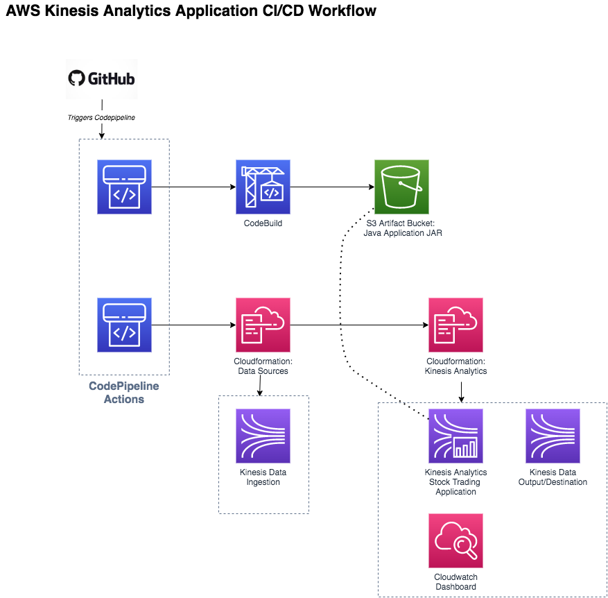

# Kinesis Analytics
AWS Kinesis Data Analytics - Done the DevOps way

The CI/CD environment has been configured with a Build/Tooling account and Sandbox account(which is where the kinesis application and resources are deployed to). A good practice when setting your AWS account structure, essentially separating your workload accounts from the tooling/build account which roles with permissions to build and destroy infrastructure you dont want the workload accounts to have. 

Codepipeline performs cross account deployments. 

The account-iam-management folder contains the cloudformation templates which creates the roles required to deploy resources to the Sandbox account. 

 

## Application Example: Performing analytics on streaming data of Stock being traded
We will be ingesting stock trades into a kinesis data stream which an Amazon Kinesis Data Analytics application will use a source to perform calculations near-realtime.  We will be writing our own kinesis data producer to simulate the streaming stock trade prices.

The data processing application will be using Apache Flink under the Kinesis Analytics Serverless framework.

